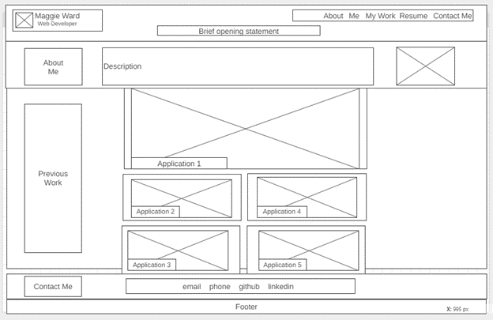

# unit-two-homework

## Description:
Portfolio webpage built from scratch, modeled after Unit 2 Homework example GIF. Currently with placeholder images and links, to be updated with functional web applications and pictures as they are created later in course. 

## Screenshot:
Wireframe:

  

Deployed website:

Deployed website, tablet view:

  

Deployed website, mobile view:

## URLs:
<a href="https://wireframe.cc/L1GSbf">Wireframe</a>
 
<a href="https://github.com/mlward639/unit-two-homework">GitHub</a>
 
<a href="https://mlward639.github.io/unit-two-homework/">URL of deployed application</a>

